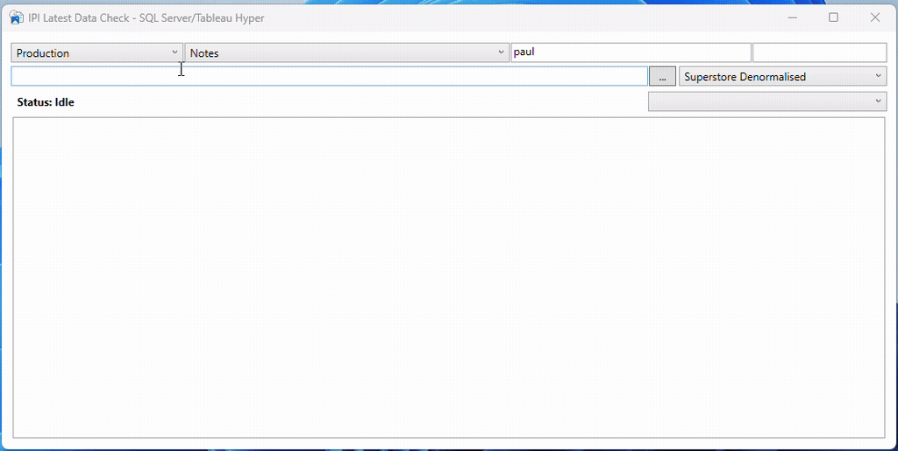
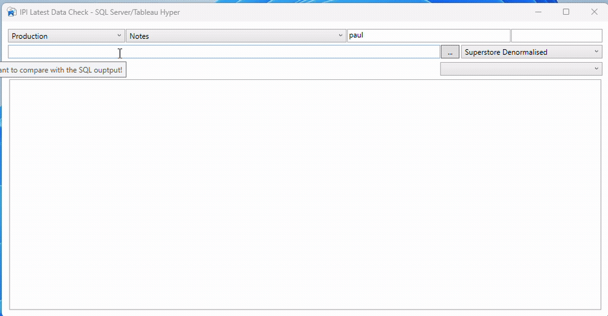
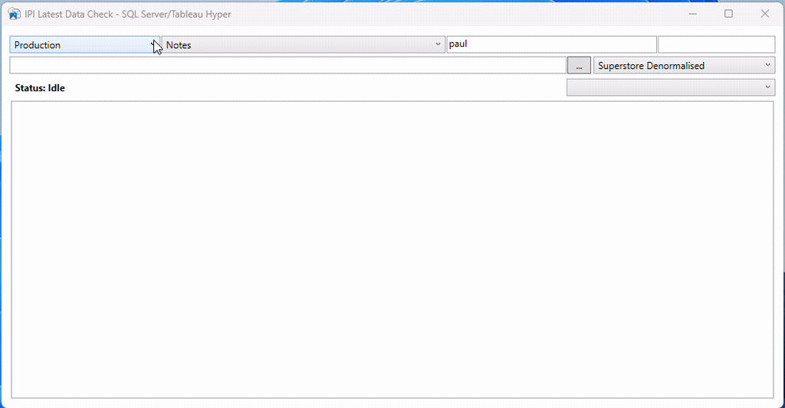

# IPI Latest Data Check - SQL Server, Tableau Hyper

I found an out of date Hyper API DLL in the nuget packages that could be used to read data from Tableau Hyper files and wanted to use it in a PowerShell
WPF GUI App. I needed to be able to check to see if the Hyper file had the latest data hosted in a SQL data warehouse. Unfortunately, after building the 
entire solution, the time to read the hyper file was undesirable. I then downloaded the latest C++ Project from the Tableau website and modified it to 
give me just the basics.

## How to Install

Copy the files and folders to a location of your choice on your network or local folders. You will have to update the Servers parameters in the GUI:
`
$Servers = @{
    LocalDB='(LocalDB)\MSSQLLocalDB'
    Development='10.0.0.1'
    Production='10.0.0.2'
}
$Database = 'tempdb'
`

## Adding Scripts

- There are two script folders (SQL and Hyper). Hyper file SQL varies from SQL Server Syntax. The App will populate the relative dropdown menus depending on which folder you store your SQL scripts in.

## Run Functions

- You can just run a SQL script query by selecting the Server, table and if reuired User Name and Password.

    

- To help you build you Hyper file SQL scripts there is an option to list the various schemas.

    

- You can then run both the SQL and Hyper file queries to determine if the hyper file data is out of date.

    

- There is an option to get the link to this repository.
- Finally you can clear the log view.
