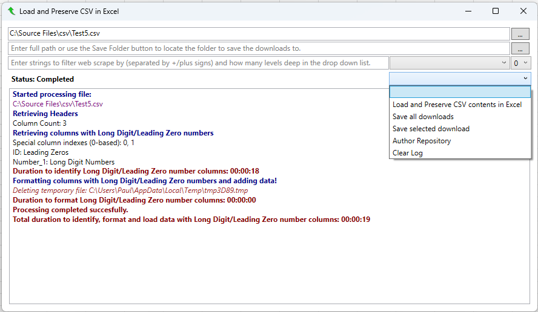
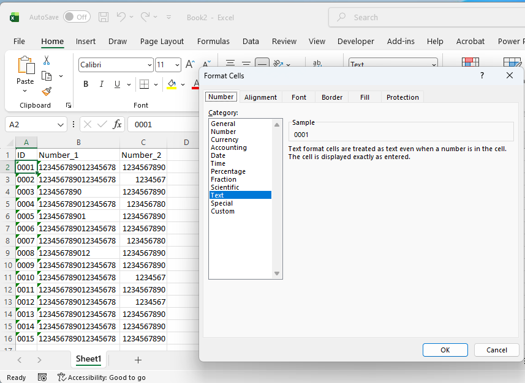
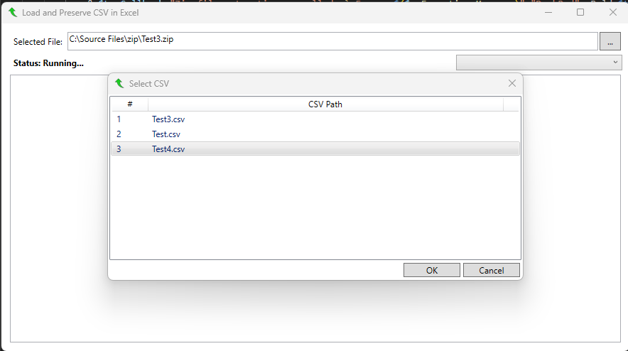
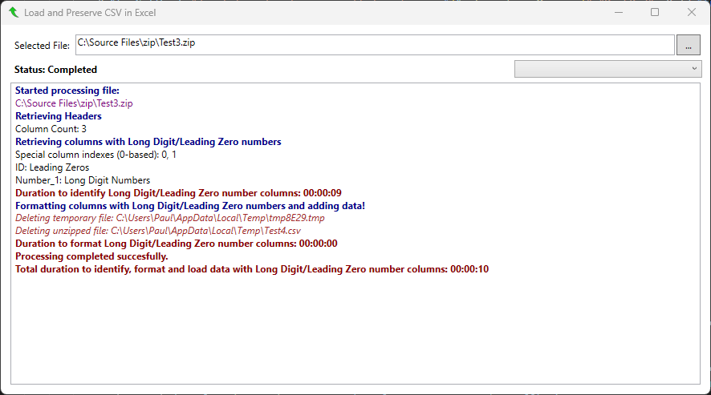
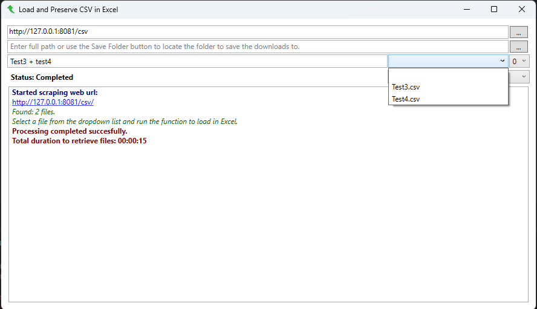
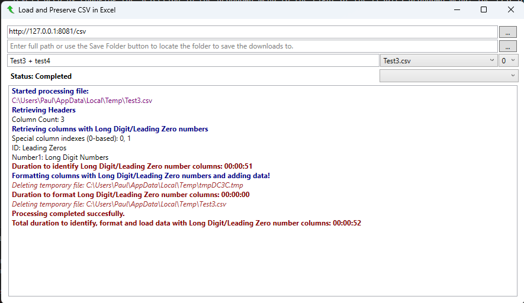
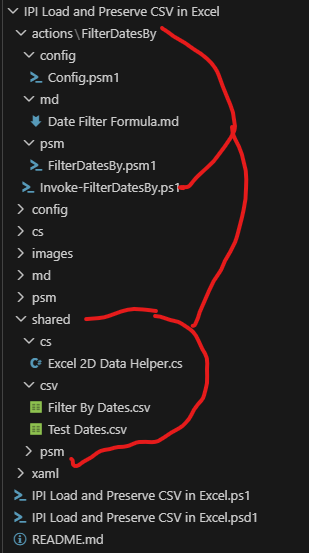
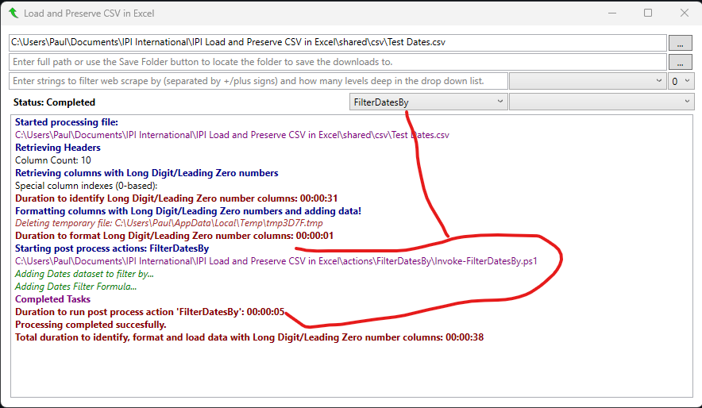
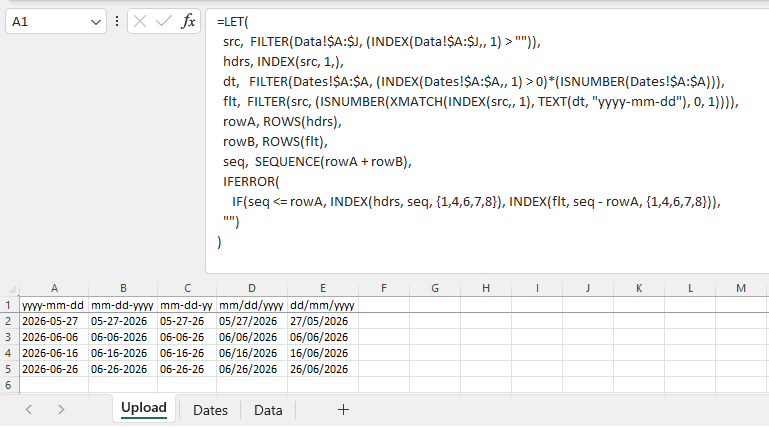

# IPI Load and Preserve CSV in Excel

I have often had times when I wanted to open CSV files in Excel without the Excel magic of removing leading zeros and converting long digit numbers to scientific notation. With a little help from ChatGPT, I made a good start at building a GUI and module to achieve the end result. As I don't have a paid subscription to ChatGPT, I found that using it without its deep reasoning meant that a lot of suggestions just used up a lot of my time only to be told at the end a reason for the failure. Yesterday, after a 12 hour session with ChatGPT and at the point it confirmed that its suggestions could not work, ChatGPT refreshed the page and all the session content vanished before I could save it.

So, I tried Google AI and asked it why ChatGPT was unable to achieve this task, giving it various info about the session. Google AI said that ChatGPT was using Python behind the scenes and could not achieve the logic I was looking for, then gave me the solution to make it all work.

## Problems Faced

- Writing output to Excel line by line would have been unbearable when deailing with CSVs containing 100K+ lines.
- Using ADODB meant that alterations had to be made to files with spaces in their row headers and creating schema.ini files on the fly. It also meant appending numerous text lines under the headers to ensure that ADODBs CopyFromRecordset did not convert data (The 12hr failure).

## Usage

- Add a shortcut to your Windows shell:sendto or any other folder that uses PowerShell.exe -File PathToPs1Script.
- Run it from VS Code, the commandline of PowerShell ISE.
- Use the browse button to select a CSV file and then choose `Load and Preserve CSV contents in Excel` from the Action dropdown menu.

    

- Wait until the process has completed before working with the Excel file.

    

- You can also choose a ZIP file when browsing and when running you will be prompted to select a CSV file within if there is more than one.

    

- Again, Wait until the process has completed before working with the Excel file.

    

- To load csv files from web sites, enter the web site base url to search from and run the `Load and Preserve CSV contents in Excel`. You can search from 0 to 5 levels deep by changing the selection in the dropdown menu to the right of the results dropdown menu. The list of csv and zip files will populate the results dropdown menu to the right of the file name filter.

    

- Use +/plus signs in the filter by text box to filter files by file names matching the entries. Once the drop down menu has been populated, select the file you want to open in excel and run the `Load and Preserve CSV contents in Excel` function again. This will download the selected file to your temp folder and load it from there, deleting it once complete.

    

- You can also choose to download the selected file from the web search or download all files displayed in the results dropdown menu. For this, you will need to enter the path to the folder location you want the files saved in or click the save to folder button next to the text box and select the folder.
- I have also added the ability to add in post processing actions. This allows the user to build custom scripts that run after the CSV has been loaded into Excel in its preserved state.
- Any folder in the **actions** folder is picked up by the main window and listed in the combo box to the left of the functions caller combo box. There is also a **shared** that all the post process actions can use to shared reusable scripts and data sources.

    

- The naming convention for post process actions is that the script file (ps1) to be called should prefix the folder name with ***Invoke-*** and then sufix it with ***.ps1*** (e.g. ***Invoke-ActionFolderName.ps1***)
- Selecting a folder name from this new list before running **Load and Preserve CSV contents in Excel** will enable calling of the script within that folder.

    

- The ***Excel 2D Data Helper.cs*** in the **shared** folder enables fast transfers from the csv files in the shared folder to the open workbook being processed.
- The ***Date Filter Formula.md*** in the **actions** folder contains the Excel formula extracted in the post process action to render the final output.

    

- Unfortunately, I only have Office 2021 on my personal computer and the luxury of Office 365 Excel functions is not available to me.
