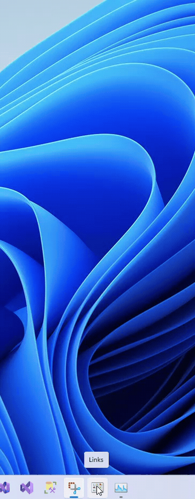

# IPI Windows 11 Taskbar Menus

I really missed being able to add a folder to my Taskbar including the Desktop item that allowed me to quickly navigate the important files and folders I wanted without altering the currently displayed window. So, with a little help from ChatGPT and a bit of guidance and effort from me I finally have something useful. I have also added a Close parameter, as I usually want to run several functions at computer startup.

## Usage

- The layout for shortcuts is (Close default is 1):

    `[PowerShell Application Path] [PowerShell Argument List] [Taskbar Script Path] [Folder Path/Key Word] [Filter Type] [Icon Number] [Close]`

- When navigating into subfolders a `...` is displayed at the top of the list to enable going back to the previous items list.
- The following shortcuts can all be put into one folder and then you create a shortcut to call that folder. You can ommit the Close parameter if you want the popup menus to close after a file is selected. i.e.

    `%windir%\System32\WindowsPowerShell\v1.0\powershell.exe -WindowStyle Hidden -ExecutionPolicy Bypass -File "%userprofile%\Documents\IPI Windows 11 Taskbar Menus\IPI Windows 11 Taskbar Menus.ps1" "%userprofile%\Documents\Links" 1 96 0`

- To get a list of all the Applications on your computer create a new Shortcut, calling it Applications and copy/paste the following:

    `%windir%\System32\WindowsPowerShell\v1.0\powershell.exe -WindowStyle Hidden -ExecutionPolicy Bypass -File "%userprofile%\Documents\IPI Windows 11 Taskbar Menus\IPI Windows 11 Taskbar Menus.ps1" Applications 0 39`

- For a list of Control Panel Items:

    `%windir%\System32\WindowsPowerShell\v1.0\powershell.exe -WindowStyle Hidden -ExecutionPolicy Bypass -File "%userprofile%\Documents\IPI Windows 11 Taskbar Menus\IPI Windows 11 Taskbar Menus.ps1" "Control Panel" 0 21`

- For a list of Desktop items:

    `%windir%\System32\WindowsPowerShell\v1.0\powershell.exe -WindowStyle Hidden -ExecutionPolicy Bypass -File "%userprofile%\Documents\IPI Windows 11 Taskbar Menus\IPI Windows 11 Taskbar Menus.ps1" Desktop 0 317`

- For a list of Start Menu Programs:

    `%windir%\System32\WindowsPowerShell\v1.0\powershell.exe -WindowStyle Hidden -ExecutionPolicy Bypass -File "%userprofile%\Documents\IPI Windows 11 Taskbar Menus\IPI Windows 11 Taskbar Menus.ps1" "C:\ProgramData\Microsoft\Windows\Start Menu\Programs" 0 84`

- Finally right click the shortcut you want and select the Add to Taskbar menu item.
- Click on the new taskbar item to navigate your menu:

    
